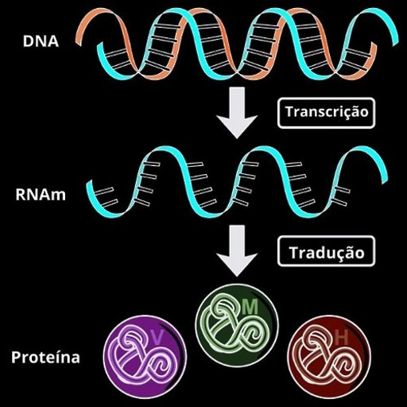

# Algoritmo de Expressão Genética (Genetic Expression Programming - GEP)

Este documento apresenta uma explicação detalhada sobre o algoritmo de Programação de Expressão Genética (GEP), inspirado pela biologia, mais especificamente na tradução do DNA em proteínas durante a síntese proteica.

## Introdução

A Programação de Expressão Genética (GEP) é uma técnica de otimização que simula processos biológicos para resolver problemas computacionais. Assim como a síntese proteica, onde o DNA é transcrito em mRNA e depois traduzido em proteínas, o GEP codifica "genes" que representam soluções para problemas específicos. A ideia central é evoluir essas soluções, gerando melhorias ao longo de várias gerações.

## Como funciona a Programação de Expressão Genética?

A GEP é baseada em uma população de indivíduos, onde cada indivíduo possui um "genoma" que representa uma solução potencial para o problema. A evolução ocorre através de operadores genéticos, como seleção, cruzamento e mutação, com o objetivo de encontrar soluções cada vez melhores.

### Analogias Biológicas

- **DNA e Mutação**: No GEP, o genoma é uma sequência de genes que pode sofrer mutações, simulando a variabilidade genética observada na natureza.
- **Síntese Proteica**: Assim como na biologia, onde o mRNA é traduzido em uma sequência de aminoácidos para formar proteínas, no GEP o genoma é traduzido em expressões matemáticas ou lógicas que representam soluções para o problema.
- **Evolução**: Ao longo das gerações, as soluções evoluem, e os "melhores" indivíduos (aqueles com maior aptidão) são selecionados para gerar a próxima geração, imitando o processo de seleção natural.



## Componentes do Algoritmo

O algoritmo apresentado é implementado em Python e possui os seguintes componentes principais:

1. **Parâmetros Globais**
   - `POPULATION_SIZE`: Tamanho da população (número de indivíduos).
   - `GENOME_LENGTH`: Comprimento do genoma (número de genes por indivíduo).
   - `MUTATION_RATE`: Taxa de mutação que determina a probabilidade de um gene sofrer mutação.
   - `GENERATIONS`: Número de gerações para a evolução.

2. **Conjuntos de Funções e Terminais**
   - `FUNCTION_SET`: Operações matemáticas que os genes podem representar (`+`, `-`, `*`, `/`).
   - `TERMINAL_SET`: Conjunto de terminais (valores constantes e variáveis, por exemplo, `x`, `1`, `2`, etc.).

3. **Geração de Genomas**
   - Cada genoma é uma sequência de genes gerada aleatoriamente, com uma mistura de funções e terminais.

4. **Avaliação da Aptidão (Fitness)**
   - A função de fitness avalia o quão bem uma expressão matemática representada pelo genoma se aproxima dos valores esperados, utilizando um conjunto de dados de teste.

5. **Operadores Genéticos**
   - **Seleção**: Indivíduos com maior aptidão são selecionados para reproduzir.
   - **Cruzamento**: Combinação de duas soluções (pais) para gerar novas soluções (filhos).
   - **Mutação**: Alteração de genes para introduzir variabilidade.

6. **Evolução da População**
   - A cada geração, a população evolui através dos operadores genéticos, com o objetivo de melhorar a aptidão média.

## Fluxo do Algoritmo

1. **Inicialização**: Uma população inicial de genomas é gerada aleatoriamente.
2. **Avaliação**: A aptidão de cada genoma é calculada com base na precisão da expressão gerada em comparação com os valores esperados.
3. **Seleção**: Os indivíduos mais aptos são selecionados para formar a próxima geração.
4. **Reprodução**: Cruzamento e mutação são aplicados para gerar uma nova população.
5. **Iteração**: O processo é repetido por um número pré-definido de gerações.
6. **Resultado Final**: A melhor solução encontrada ao longo das gerações é reportada.

## Código do Algoritmo

O algoritmo foi implementado seguindo os passos descritos acima. A seguir estão algumas funções do código:

### Função de Geração de Genomas

```python
def generate_genome():
    genes = []
    for _ in range(GENOME_LENGTH):
        if random.random() < 0.5:
            genes.append(random.choice(FUNCTION_SET))
        else:
            genes.append(random.choice(TERMINAL_SET))
    return genes
```

### Função de Avaliação da Aptidão

```python
def fitness(genome):
    expression = parse_expression(genome)
    total_error = 0.0
    for x_val, y_true in DATA_SET:
        try:
            y_pred = eval(expression, {'x': x_val, 'math': math})
            total_error += abs(y_true - y_pred)
        except (ZeroDivisionError, SyntaxError, NameError, TypeError):
            return float('inf')
    return total_error / len(DATA_SET)
```

### Função de Evolução da População

```python
def evolve(population):
    new_population = []
    selected = selection(population)
    while len(new_population) < POPULATION_SIZE:
        parent1 = random.choice(selected)
        parent2 = random.choice(selected)
        child1_genes, child2_genes = crossover(parent1, parent2)
        child1 = mutate(child1_genes)
        child2 = mutate(child2_genes)
        new_population.extend([child1, child2])
    return new_population[:POPULATION_SIZE]
```

### Função de Cruzamento

```python
def crossover(parent1, parent2):
    idx = random.randint(1, GENOME_LENGTH - 1)
    child1_genes = parent1[:idx] + parent2[idx:]
    child2_genes = parent2[:idx] + parent1[idx:]
    return child1_genes, child2_genes
```
